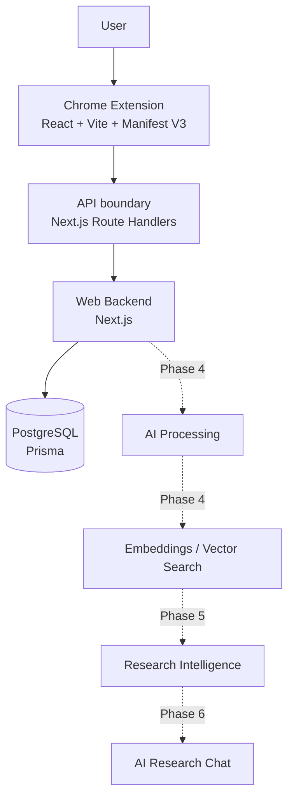
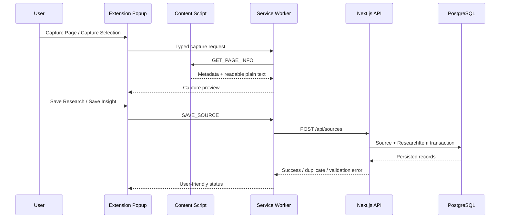
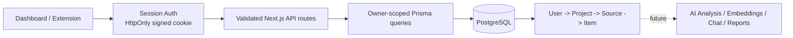
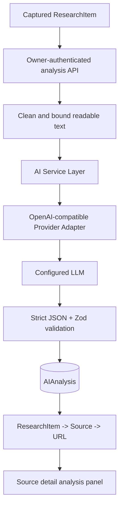
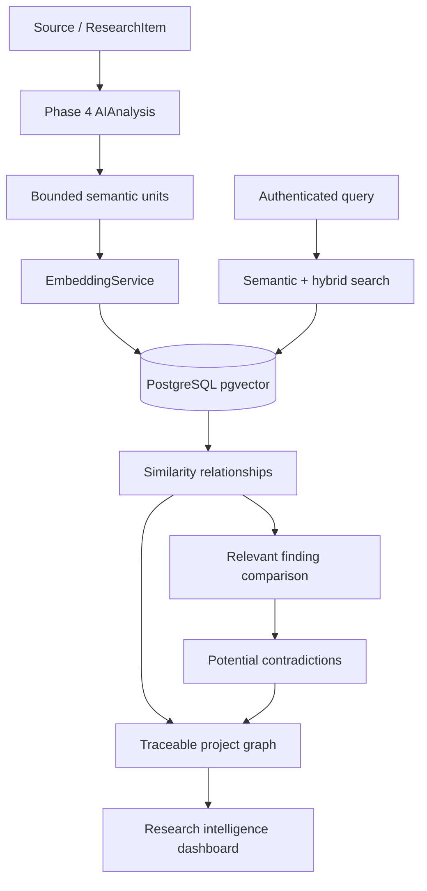
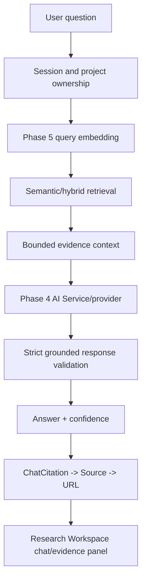
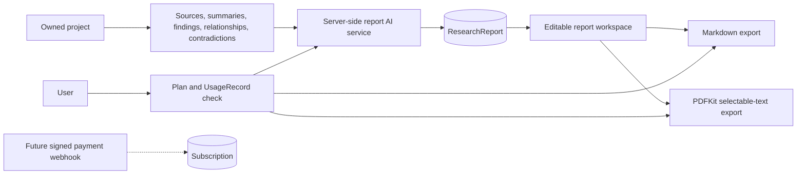

# ResearchFlow Architecture

## 1. Overall architecture

ResearchFlow is a separated monorepo: the Chrome Extension owns browser capture surfaces, the Next.js application owns the web UI and server APIs, `packages/shared` owns cross-application contracts, and `packages/database` owns Prisma/PostgreSQL access. Phase 1 intentionally contains no AI processing or research intelligence.

Dashed connections are future phases and are not implemented in Phase 1.

## 2. Chrome Extension architecture

The MV3 extension contains a React popup, a background service worker, and a content script. The popup exposes the Phase 1 product surface. The content script can read the current URL, title, hostname, description metadata, and current selection. The service worker is the communication seam for future capture requests; it does not persist or transmit research yet.

## 3. Web application architecture

`apps/web` is a Next.js App Router application. The dashboard is a responsive, accessible foundation with navigation and explicit coming-soon states for future capabilities. Route handlers under `app/api` provide server-side API boundaries and keep database credentials out of browser code.

## 4. Database architecture

`packages/database/prisma/schema.prisma` defines only the Phase 1 entities: `User`, `ResearchProject`, `Source`, and `ResearchItem`. Relationships cascade from user to projects and projects to sources/items. IDs use Prisma cuid values; timestamps use database-backed defaults and Prisma update timestamps. Future AI/RAG tables can reference `Source` and `ResearchItem` without changing their meaning.

## 5. Communication flow

1. A user opens the popup on a webpage.
2. The popup sends a typed message to the service worker.
3. The service worker can ask the content script for page context.
4. Future phases will validate a capture request at the server API.
5. The Next.js route handler will use Prisma to write to PostgreSQL.

Phase 1 stops before step 4 for capture persistence.

## 6. Future AI/RAG integration points

- Add extraction and normalization services behind API/server modules in Phase 4.
- Add embedding records and a vector index referencing `ResearchItem` in Phase 5.
- Add contradiction and similarity workflows as domain services in Phase 5.
- Add conversations/messages and retrieval orchestration in Phase 6.

These are documented extension points, not placeholder implementations.

## 7. Security considerations

- Server-side validation uses Zod for project and source payloads.
- `DATABASE_URL` and future AI keys are environment-only; no secret is bundled into the extension.
- API routes are server modules and do not expose Prisma to the client.
- Stored content should be sanitized at the capture boundary in Phase 2 before rendering as HTML.
- The content script reads DOM metadata only and never evaluates page-provided code.
- Production deployment should add authentication, CSRF protection where cookie auth is used, strict CORS allowlists, rate limiting, and secure headers before public release.

## Phase 2 capture architecture

The extension now implements a real capture path without bypassing the backend:

Readable extraction operates on a cloned DOM and removes executable/non-content elements before returning plain text. The service worker owns backend communication, context-menu capture, current-project storage, and typed message routing. The popup owns preview and confirmation. Duplicate URL and exact selected-insight checks are performed server-side so they cannot be bypassed by a modified extension client.

## Phase 3 backend and ownership architecture

Phase 3 adds a server-side session boundary before the existing project/source/item graph. Email/password credentials are hashed with bcryptjs; a signed HttpOnly session cookie identifies the current user. Every project, source, and research-item query applies an ownership predicate at the database query level. The browser and extension never provide an authoritative `userId`.

The Phase 3 migration is additive: it adds plan/billing-interval foundation fields, password/session support fields, source metadata and canonical URL uniqueness, indexes, and generic usage counters. It preserves original source URLs and keeps Phase 2 `PAGE_CONTENT` items valid.

## Phase 4 AI content processing architecture

AI processing is isolated behind a server-only provider abstraction. The dashboard and extension never receive provider credentials.

The `AIAnalysis` record stores the source, research item, input hash, prompt version, provider/model, structured output, status, retry count, and safe error state. The `(researchItemId, inputHash)` constraint makes repeated analysis idempotent unless the user explicitly requests re-analysis. Embeddings, vector search, RAG, chat, contradictions, and reports remain future-phase capabilities.

## Phase 5 research intelligence architecture

Phase 5 extends the same server-side AI architecture with an embedding provider and a tenant-scoped intelligence service. PostgreSQL remains the system of record; pgvector stores the 1536-dimensional vector column and HNSW index.

Every embedding and relationship stores user/project/source/entity anchors. Search, similarity, contradictions, and graph APIs verify ownership before reading data. Phase 6 chat and Phase 7 reports are not included.

## Phase 6 grounded research chat architecture

Phase 6 reuses Phase 5 retrieval instead of introducing another vector system. Chat sessions and citations are private, owner-scoped records.

The research-chat prompt treats all captured webpage content as untrusted evidence and explicitly prevents embedded webpage instructions from overriding system instructions. Phase 7 reports and exports remain deferred.

## Phase 7 reports, exports, and plan architecture

Phase 7 adds a grounded report service over the existing project, AI analysis, intelligence, and contradiction records. It does not create a parallel research store.

Free/Pro limits are centralized in the billing module and enforced server-side for reports and exports. Payment processing is intentionally not implemented.
