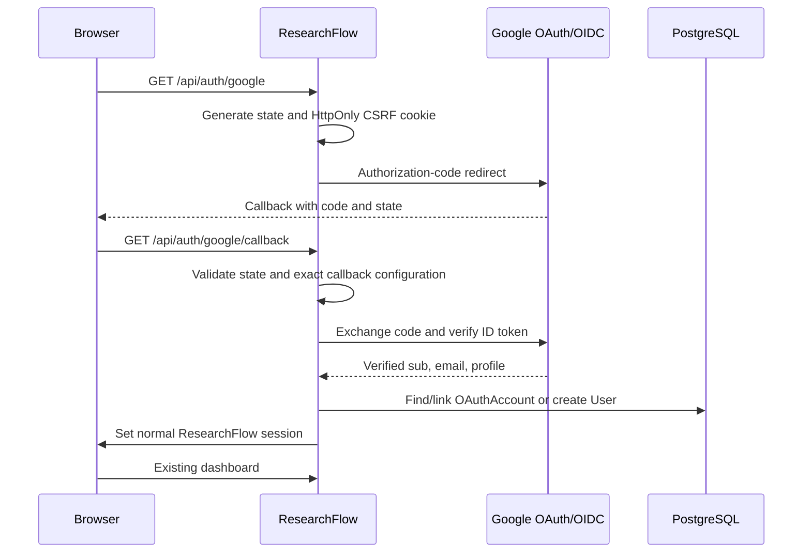

# Google Sign-In Setup

ResearchFlow uses the existing custom authentication architecture: bcrypt password authentication plus signed HttpOnly JWT sessions. Google Sign-In adds an OAuth identity mapping and then creates the same normal ResearchFlow session. It does not create a second session system.

## Implementation

The flow is:



Google is handled through `google-auth-library`. The server exchanges the authorization code and verifies the OpenID Connect ID token. No custom JWT parsing or browser token verification is used.

## Environment variables

```env
GOOGLE_CLIENT_ID=""
GOOGLE_CLIENT_SECRET=""
GOOGLE_CALLBACK_URL="http://localhost:3000/api/auth/google/callback"
```

`GOOGLE_CLIENT_SECRET` is server-only. Never add any Google credential to `NEXT_PUBLIC_*`, the Chrome Extension, or source control.

For production, the callback URL must exactly match the deployed HTTPS URL, for example:

```env
GOOGLE_CALLBACK_URL="https://research.example.com/api/auth/google/callback"
```

## Google Cloud Console setup

1. Open [Google Cloud Console](https://console.cloud.google.com/).
2. Create a new project or select the ResearchFlow project.
3. Open **APIs & Services → OAuth consent screen**.
4. Choose the appropriate user type for the deployment.
5. Set the application name to `ResearchFlow`.
6. Add the application support email and developer contact email.
7. Add the scopes used by this implementation:
   - `openid`
   - `email`
   - `profile`
8. Add test users if the consent screen remains in testing mode.
9. Open **APIs & Services → Credentials**.
10. Choose **Create Credentials → OAuth client ID**.
11. Select **Web application**.
12. Add the deployed application origin under **Authorized JavaScript origins** when required by the Google Console configuration:
    - Local: `http://localhost:3000`
    - Production: `https://your-domain.example`
13. Add the exact callback under **Authorized redirect URIs**:
    - Local: `http://localhost:3000/api/auth/google/callback`
    - Production: `https://your-domain.example/api/auth/google/callback`
14. Copy the generated Client ID into `GOOGLE_CLIENT_ID`.
15. Copy the generated Client Secret into `GOOGLE_CLIENT_SECRET`.
16. Set `GOOGLE_CALLBACK_URL` to the same redirect URI registered in Google Cloud Console.
17. Restart the web server after changing environment variables.

No separate Google OAuth flow is implemented in the extension. The extension continues to open ResearchFlow for authentication and uses the existing backend/session approach.

## Account behavior

- New verified Google email: creates one ResearchFlow user and one `OAuthAccount` record.
- Existing verified email account: links Google to the existing user and preserves projects, sources, reports, subscriptions, and usage.
- Existing Google identity: logs into the already-linked user.
- Unverified Google email: rejected.
- Duplicate provider identity: prevented by a database unique constraint.
- Provider identity belonging to another email: rejected.

Google access tokens are not stored because ResearchFlow only needs identity for sign-in.

## Security controls

- OAuth state is generated with cryptographically secure randomness.
- State is stored in a short-lived HttpOnly SameSite cookie.
- State comparison uses constant-time comparison.
- Callback URL is configured server-side and validated as HTTP/HTTPS.
- Return paths are restricted to application-relative paths.
- Client secret is never sent to the browser.
- Google ID tokens are verified by the official Google client library.
- Only verified Google email identities are accepted.
- No OAuth access/refresh tokens are logged or persisted.
- The normal ResearchFlow HttpOnly session is created after successful identity verification.
