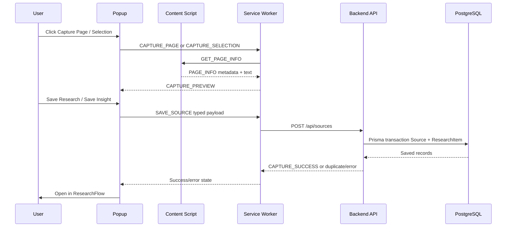

# Phase 2 — Chrome Extension Capture System

## Scope

Phase 2 converts the Phase 1 extension shell into a real capture workflow. It captures page metadata and readable text in the content script, previews it in the popup, and sends only validated text/metadata through the service worker to the Next.js API. AI, embeddings, semantic search, authentication, and reports remain out of scope.

## Capture workflow

1. The popup asks the active tab's content script for `PageInfo`.
2. The content script extracts metadata and readable text from a DOM clone. Scripts, styles, navigation, forms, and hidden content are removed from the clone; the original page is never replaced.
3. The popup displays a compact preview and the selected research project.
4. The user chooses Capture Page or Capture Selection, then confirms Save Research/Save Insight.
5. The service worker POSTs the capture to `/api/sources`.
6. The API validates and sanitizes text, checks duplicate URLs/selection items, then creates a `Source` and `ResearchItem` in one Prisma transaction.
7. The extension shows success/error state and can open the source detail route.

## Extension components

- `src/popup/main.tsx`: compact preview, project selector, save states, dashboard links.
- `src/content/extractor.ts`: metadata and readable-text extraction.
- `src/content.ts`: minimal message listener for page information.
- `src/background.ts`: typed message router, backend client, context menu, and storage for current project.
- `public/manifest.json`: MV3 permissions and content-script registration.

## Message flow

Context-menu selection capture uses the same content-script and service-worker path. If no current project is stored, the selection is held as a pending local capture and ResearchFlow is opened so the user can choose/create a project.

## API flow

`POST /api/sources` now accepts `projectId`, source metadata, `content`, `itemType`, and `allowDuplicate`. It returns `409` with `code: DUPLICATE_SOURCE` or `DUPLICATE_ITEM` instead of silently creating an obvious duplicate. `GET /api/sources/:sourceId` supports the minimum source-detail dashboard route.

## Database flow

No schema changes were required. Existing `Source` and `ResearchItem` models are reused. A successful capture creates both records in one transaction; a failed transaction does not leave a partial source/item pair.

## Security considerations

- The extension has no API or AI secret.
- The content script reads DOM values and never uses `eval`, injected executable code, or HTML persistence.
- Extraction operates on a cloned DOM and returns plain text.
- The API validates URL, project ID, metadata lengths, item type, and content size with Zod.
- Server-side text cleaning removes null/control characters before persistence.
- Extension requests use the backend API; the extension never connects to PostgreSQL.
- Authentication and ownership checks are not yet implemented and must be addressed before public deployment in Phase 3.

## Testing results

Passed in the implementation environment: workspace lint, TypeScript checks, Prisma client generation, Prisma schema validation, web production build, extension production build, MV3 manifest artifact check, dashboard health endpoint, and hard-coded-secret scan. Live PostgreSQL CRUD/migration and manual Chrome Developer Mode interaction require Docker/Chrome and are recorded as environment-dependent checks.

## Known limitations

- The current project selector reads available projects from the Phase 1 unauthenticated project endpoint. Authentication/ownership is intentionally deferred to Phase 3.
- Context-menu capture saves directly when a current project is stored; otherwise it stores a pending local capture and opens the dashboard.
- Readability extraction is a dependency-free heuristic, not a full Mozilla Readability implementation.
- The local sandbox used for validation did not have Docker installed, so database-backed end-to-end capture was not executed there.
