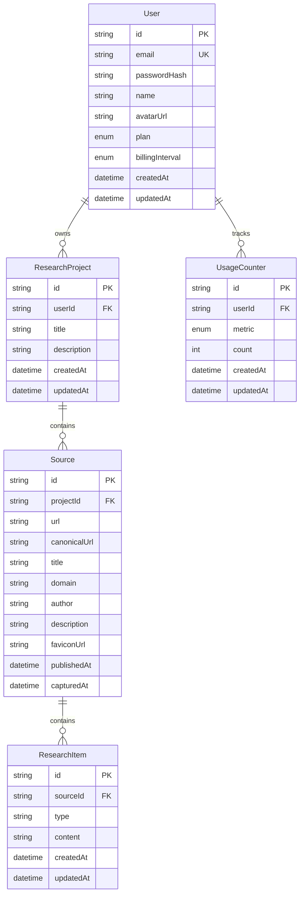

# Phase 3 — Backend, Database & User Data Architecture

## Scope

Phase 3 hardens the Phase 1–2 backend and data layer. It adds server-side account sessions, owner-scoped CRUD, pagination, database-level source uniqueness, source metadata, research-item APIs, and a generic usage counter. AI/RAG features, payments, subscriptions checkout, and analytics remain out of scope.

## Database architecture

The existing `User → ResearchProject → Source → ResearchItem` relationship was preserved and extended additively.



`Source.url` preserves the original URL. `Source.canonicalUrl` is used only for duplicate detection within a project. The database unique constraint is `(projectId, canonicalUrl)`, so the same URL remains valid in different projects.

The existing `ResearchItem.type` remains a string for backward compatibility with Phase 2 `PAGE_CONTENT` values. API validation currently accepts `PAGE`, `PAGE_CONTENT`, `SELECTION`, and `NOTE`.

## Migration strategy

- `20261005120000_phase1_initial`: baseline for fresh databases because Phase 1 did not yet have a committed migration.
- `20261005130000_phase3_backend_foundation`: additive Phase 3 migration adding account fields, source metadata/canonical URL, indexes, unique constraints, and `UsageCounter`.

For an existing database created with `prisma db push` rather than migrations, inspect and resolve the baseline as applied before deploying the Phase 3 migration. Never run a destructive reset against real data.

## Authentication

Authentication uses email/password credentials with:

- bcrypt password hashing
- signed HS256 session tokens
- `HttpOnly`, `SameSite=Lax`, `Secure` in production cookies
- 30-day session expiry
- server-side current-user lookup
- responses that exclude `passwordHash`

Endpoints:

- `POST /api/auth/register`
- `POST /api/auth/login`
- `POST /api/auth/logout`
- `GET /api/auth/me`

`AUTH_SECRET` is required and must be at least 32 characters. No authentication secret is bundled into the extension.

## Authorization

Every project, source, and research-item route derives the user from the signed server session. Client-provided `userId` values are no longer accepted for project creation. Ownership predicates are applied in database queries, not only in UI logic:

- projects query `userId`
- sources query through `project.userId`
- research items query through `source.project.userId`

Missing or foreign records return `404` rather than revealing whether another user's ID exists.

## API architecture

### Projects

- `POST /api/projects`
- `GET /api/projects?page=1&limit=20&search=...`
- `GET /api/projects/:projectId`
- `PATCH /api/projects/:projectId`
- `DELETE /api/projects/:projectId`

### Sources

- `POST /api/sources`
- `GET /api/sources?page=1&limit=20&projectId=...&search=...`
- `GET /api/sources/:sourceId`
- `PATCH /api/sources/:sourceId`
- `DELETE /api/sources/:sourceId`

### Research items

- `POST /api/sources/:sourceId/items`
- `GET /api/sources/:sourceId/items?page=1&limit=20`
- `GET /api/sources/:sourceId/items/:itemId`
- `DELETE /api/sources/:sourceId/items/:itemId`

### Health

- `GET /api/health`

Successful collection responses use:

```json
{ "items": [], "page": 1, "limit": 20, "total": 0, "totalPages": 0 }
```

Zod validates IDs, URL shape, enum values, string lengths, content size, and pagination bounds. API errors are clean JSON responses and do not expose database stack traces.

## Free/Pro and usage foundation

`User.plan` represents `FREE` or `PRO`; `User.billingInterval` represents `NONE`, `MONTHLY`, or `YEARLY`. No client-side variable can activate Pro and no payment processing is implemented.

`UsageCounter` is generic and currently increments `SOURCES_CAPTURED` on successful capture. Future metrics are represented in the enum for later phases: `AI_SUMMARIES`, `AI_CHAT_MESSAGES`, and `REPORTS_GENERATED`. No AI limits are enforced in Phase 3.

## Security review

Implemented protections:

- no client-controlled user ownership
- owner-scoped project/source/item queries
- signed HttpOnly sessions
- bcrypt password hashes
- bounded request fields and content
- canonical URL uniqueness within a project
- plain-text content cleaning
- no raw HTML persistence
- no API keys in extension code
- no `eval` or arbitrary code execution
- no raw server stack traces in API responses

## Phase 2 compatibility

The extension continues to send `PAGE_CONTENT` and `SELECTION` captures. It now sends credentials with project/source requests and understands paginated project responses. If no session is present, the popup reports that the user must sign in at ResearchFlow.

## Future relationships

The following remain future-phase additions and are not implemented:

- AI Analysis records — Phase 4
- Embeddings/vector index — Phase 5
- Conversations/messages — Phase 6
- Reports — Phase 7
- Subscription provider/customer records — future billing work after Phase 3

## Testing and known environment limitation

Unit tests cover URL canonicalization, content bounds/cleaning, ID validation, pagination bounds, and password hashing. An opt-in PostgreSQL integration suite covers owner-scoped project/source access and canonical duplicate enforcement; run it with `RUN_DB_TESTS=1` after migrations.

The current sandbox has no Docker/PostgreSQL service, so live migrations, auth API persistence, and end-to-end extension-to-database capture must be run in a local environment with PostgreSQL.
