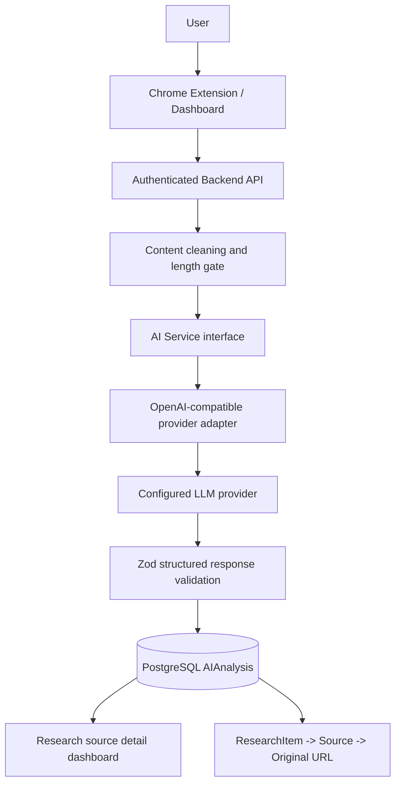

# Phase 4 — AI Content Processing Engine

## Scope

Phase 4 adds real server-side AI processing for captured ResearchFlow content. It supports summaries, key points, key findings, keywords, topics, and conservative content classification. The original `Source` and `ResearchItem` remain the traceability anchors.

Vector search, embeddings, RAG, contradiction detection, chat, report generation, and payments are deliberately not implemented.

## Architecture



Application code calls the service layer, not a provider SDK from components:

```text
Dashboard/API route
  ↓
AI runner
  ↓
AI service
  ↓
AI provider interface
  ↓
OpenAI-compatible adapter
  ↓
LLM endpoint
```

The adapter is isolated at `apps/web/app/lib/ai/providers/openai.ts`, so another provider can implement the same `AIProvider` interface later.

## Provider and model

The configured provider is an OpenAI-compatible chat-completions endpoint. The live configured model catalog was checked during implementation and included `gpt-5-mini`; it is the default model because it is appropriate for structured summarization/classification and cost-controlled processing.

The default provider settings are:

```env
AI_PROVIDER="openai-compatible"
AI_API_KEY=""
AI_BASE_URL="https://api.openai.com/v1"
AI_MODEL="gpt-5-mini"
AI_FREE_ANALYSIS_LIMIT="10"
```

The server also accepts the existing sandbox-compatible `OPENAI_API_KEY` and `OPENAI_API_BASE` as fallbacks. The AI key is read only by server-side route code and is never sent to the Chrome Extension or browser client.

No API key is committed to the repository.

## Processing workflow

1. The authenticated owner opens a source detail page.
2. The user clicks **Analyze with AI**.
3. The API verifies source ownership.
4. The selected/latest `ResearchItem` content is cleaned.
5. Content shorter than 120 readable characters is rejected.
6. Content over 30,000 characters is intelligently bounded using the beginning and end with an omission marker.
7. A SHA-256 input hash is computed.
8. An existing completed analysis for the same item/hash is reused unless re-analysis is requested.
9. An `AIAnalysis` row moves through `PENDING` → `PROCESSING`.
10. The provider returns strict JSON-schema output.
11. Zod validates the response before persistence.
12. The row becomes `COMPLETED`, or `FAILED` with a user-safe message.
13. The dashboard displays the result beside the original source and captured content.

Source saving is independent of AI processing. The extension still saves research first; analysis is an explicit dashboard action.

## Structured output schema

```json
{
  "summary": "A concise faithful summary",
  "keyPoints": ["Important factual point"],
  "keyFindings": [
    { "finding": "Meaningful source-supported finding", "importance": "high" }
  ],
  "keywords": ["research"],
  "topics": ["software engineering"],
  "contentType": "documentation"
}
```

Allowed content types:

- `research_article`
- `news`
- `blog`
- `documentation`
- `tutorial`
- `academic`
- `product`
- `opinion`
- `other`

Finding importance is `high`, `medium`, or `low`.

The response is validated with Zod and the provider's strict JSON-schema response format. Invalid JSON, missing fields, extra schema-incompatible values, and empty provider output are rejected.

## Prompt architecture

Prompts are centralized and versioned in `app/lib/ai/prompts.ts`:

- `ANALYSIS_SYSTEM_PROMPT`
- `buildAnalysisPrompt`
- `ANALYSIS_RESPONSE_SCHEMA`
- `ANALYSIS_PROMPT_VERSION`

Current prompt version:

```text
research-analysis-v1
```

The system prompt explicitly instructs the model to:

- use only supplied source content
- avoid invented facts, citations, statistics, or entities
- distinguish source information from interpretation
- return `Insufficient information` where appropriate
- classify conservatively as `other`

## Database changes

Added the `AIAnalysis` model with:

- `sourceId`
- `researchItemId`
- `inputHash`
- `summary`
- `keyPoints` JSON
- `keyFindings` JSON
- `keywords` JSON
- `topics` JSON
- `contentType`
- `provider`
- `model`
- `promptVersion`
- `status`
- `errorMessage`
- `attemptCount`
- `startedAt`
- `completedAt`
- timestamps

The unique key `(researchItemId, inputHash)` prevents accidental duplicate analyses for unchanged content.

Added status enum:

```text
PENDING
PROCESSING
COMPLETED
FAILED
```

Added `AI_ANALYSES` to the existing generic usage metric enum.

Migration:

```text
20261005220000_phase4_ai_analysis
```

## API endpoints

```text
GET  /api/sources/:sourceId/analysis
POST /api/sources/:sourceId/analysis
POST /api/sources/:sourceId/analysis/retry
```

`POST /analysis` accepts:

```json
{
  "itemId": "optional-research-item-id",
  "reAnalyze": false
}
```

The retry endpoint forces a fresh attempt against the same captured content.

All endpoints require authentication and owner-scoped source access.

## Retry and error handling

The provider adapter retries one time for transient failures:

- timeout
- network failure
- HTTP 408
- HTTP 409
- HTTP 429
- HTTP 5xx

It does not retry indefinitely. User-facing errors cover:

- missing provider configuration
- unsupported provider
- insufficient content
- provider timeout
- rate limit
- provider unavailability
- invalid JSON
- structured-output validation failure
- database unavailable

Provider secrets and stack traces are never returned to the client.

## Cost control

The AI call is explicit and user-triggered. Source saving does not automatically consume AI usage.

The server-side usage hook:

- checks the user's server-side `FREE`/`PRO` plan
- applies a provisional configurable FREE analysis limit
- records successful analyses in `UsageCounter`
- leaves PRO/subscription verification extensible for later billing work

The current provisional default is 10 AI analyses for FREE accounts. It is intentionally a simple foundation, not a final subscription system.

## Dashboard behavior

The source detail page now includes a focused **AI analysis** panel with:

- Analyze with AI
- Analyzing research…
- Analysis complete
- Analysis failed
- Retry analysis
- Re-analyze
- Summary
- Key points
- Key findings with importance badges
- Keywords
- Topics
- Content classification
- Provider/model metadata

This is a research workspace panel, not a chatbot interface.

## Traceability

Every analysis stores both `sourceId` and `researchItemId`:

```text
AIAnalysis
  ↓
ResearchItem
  ↓
Source
  ↓
Original URL
```

The dashboard continues to show the original URL and provides the **View Source** link before and alongside AI output.

## Privacy

Research content is private by default. Only the cleaned, bounded text explicitly submitted through **Analyze with AI** is sent to the configured provider. The Chrome Extension never receives the AI key.

ResearchFlow does not automatically use user research content for model training. No training opt-in or data-sharing workflow is implemented in Phase 4.

Provider retention and training policies remain dependent on the configured provider and deployment. Operators should review the selected provider's terms before production use.

## Testing

Automated tests cover:

- structured output validation
- hallucination-control prompt requirements
- minimum content checks
- large-content bounding
- Phase 3 ownership and auth regression tests

A real provider smoke call was performed against the configured OpenAI-compatible endpoint using `gpt-5-mini`. It returned valid JSON with all required structured fields.

The full database-backed analysis workflow requires PostgreSQL and was not executed in the sandbox because Docker/PostgreSQL is unavailable.

## Explicitly deferred

- embeddings
- vector database
- semantic search
- RAG
- contradiction detection
- similarity graph
- AI research chat
- report generation
- payment gateway
- Stripe/PayPal
- subscription checkout
