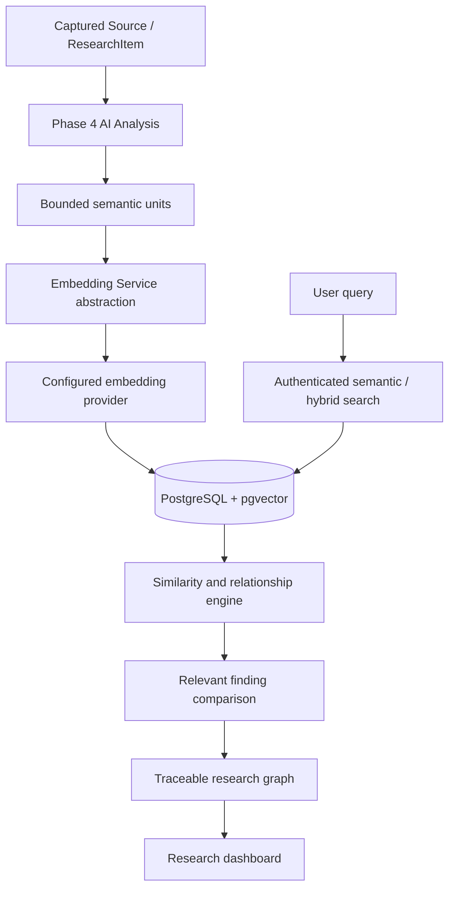

# Phase 5 — Research Intelligence Engine

## Status

Phase 5 is implemented as an additive intelligence layer over the Phase 1–4 architecture. Phase 6 AI Research Chat and Phase 7 reports/finalization have not been started.

## Architecture



All AI and embedding calls remain server-side. The extension continues to capture and save research; intelligence belongs to the web dashboard.

## Vector storage and pgvector

The existing PostgreSQL architecture is retained. Docker Compose now uses:

```text
pgvector/pgvector:pg16
```

The Phase 5 migration runs:

```sql
CREATE EXTENSION IF NOT EXISTS vector;
```

Embeddings are stored in an additive `Embedding` table with a raw PostgreSQL `vector(1536)` column. Prisma manages relational fields and ownership; raw SQL is used for cosine-distance operators and the HNSW index because Prisma does not natively model pgvector distance operations.

The migration creates:

- `vector(1536)` storage
- HNSW cosine index
- tenant/status indexes
- embedding status enum
- relationship enum
- contradiction classification enum
- ownership foreign keys

The sandbox used for implementation does not have Docker or `psql`, so the migration could not be applied locally. It is designed for the documented Compose PostgreSQL service.

## Embedding provider

Embedding calls are routed through:

```text
apps/web/app/lib/intelligence/embedding-provider.ts
```

The business layer depends on the `EmbeddingProvider` interface rather than a provider SDK.

Configuration:

```env
EMBEDDING_PROVIDER="openai-compatible"
EMBEDDING_API_KEY=""
EMBEDDING_BASE_URL="https://api.openai.com/v1"
EMBEDDING_MODEL="text-embedding-3-small"
EMBEDDING_DIMENSIONS="1536"
```

The provider implementation calls the server-side `/embeddings` endpoint and rejects missing, malformed, non-finite, or wrong-dimensional vectors. It never returns secrets to the client and never fabricates vectors.

If the configured provider does not expose the selected embedding model, the operation fails with a user-safe error; no fake embedding is stored.

## Embedding pipeline

`embedSource()` creates meaningful units rather than blindly embedding unlimited raw documents:

- bounded source content
- research items of useful length
- completed AI summaries
- individual AI findings

Each unit stores:

- user ID
- project ID
- source ID
- research item ID where applicable
- analysis ID where applicable
- entity type/key
- content hash
- short content preview
- provider/model
- dimensions
- status
- attempt count
- error message

The unique `(entityType, entityKey, contentHash)` constraint reuses embeddings when content is unchanged.

Statuses:

```text
PENDING
PROCESSING
COMPLETED
FAILED
```

The initial Phase 5 job abstraction is an explicit server-side intelligence action:

```text
POST /api/sources/:sourceId/intelligence
```

Source capture and Phase 4 AI analysis remain independent. A future worker can consume the same persisted status model without changing the API contract.

## Semantic and hybrid search

Endpoint:

```text
GET /api/search/semantic?q=...&projectId=...&limit=20
```

Flow:

1. Validate a minimum three-character query.
2. Verify authentication.
3. Verify project ownership if a project filter is supplied.
4. Generate a query embedding server-side.
5. Search only completed vectors belonging to the authenticated user.
6. Optionally restrict to the authenticated user's project.
7. Rank by cosine similarity.
8. Add a small exact-preview keyword signal for a simple hybrid ranking.
9. Return a bounded result set with traceability metadata.

Returned fields include:

- source ID
- entity type/key
- title
- relevant preview
- URL
- similarity
- relevance score
- project ID

The initial hybrid score is intentionally simple:

```text
relevance = 0.8 × cosine similarity + 0.2 × exact preview match
```

## Similar source detection

When a source is embedded, the service compares its completed source/summary/research-item vectors against other completed vectors in the same user and project.

Configurable threshold:

```env
SIMILAR_SOURCE_THRESHOLD="0.82"
```

Relationships are described conservatively:

- `Highly similar` for very high scores
- `Possibly related` for threshold-level scores

The implementation does not make absolute duplicate claims.

Endpoint:

```text
GET /api/sources/:sourceId/similar
```

## Similar finding detection

Findings use stable entity keys of the form:

```text
analysisId:findingIndex
```

Endpoint:

```text
GET /api/findings/:findingId/similar
```

Only completed finding embeddings belonging to the same authenticated user are searched. Results include the original source URL and preview.

## Contradiction analysis

The contradiction engine first finds reasonably similar finding pairs using vector similarity. It does not compare every pair and does not classify semantic difference as contradiction.

Configurable safeguards:

```env
CONTRADICTION_SIMILARITY_THRESHOLD="0.78"
MAX_INTELLIGENCE_COMPARISONS="20"
```

The server-side comparison prompt instructs the model to:

- use only the two supplied findings
- avoid invented facts, citations, statistics, or context
- distinguish semantic difference from contradiction
- preserve uncertainty
- use `INSUFFICIENT_INFORMATION` when evidence is inadequate

Classifications:

```text
SUPPORTS
CONTRADICTS
PARTIALLY_CONTRADICTS
UNRELATED
INSUFFICIENT_INFORMATION
```

Endpoint:

```text
GET  /api/contradictions?projectId=...
POST /api/contradictions?projectId=...
```

The UI/API should describe these as potential contradictions, not established truth.

## Relationship model

`ResearchRelationship` supports:

```text
SIMILAR
SUPPORTS
CONTRADICTS
PARTIALLY_CONTRADICTS
RELATED
DERIVED_FROM
MENTIONS_TOPIC
```

Each relationship stores:

- authenticated user
- project
- source anchor
- source entity type/key
- target entity type/key
- optional target source
- confidence
- explanation
- timestamps

Endpoint:

```text
GET /api/relationships?projectId=...&type=...
```

All relationship queries are tenant-scoped.

## Research graph

The graph is derived from owned sources, latest completed analyses, findings, and relationships. It does not introduce a separate graph database.

Endpoint:

```text
GET /api/projects/:projectId/graph
```

Graph nodes include:

- source nodes
- finding nodes
- source URL
- source ID
- display label
- entity type

Graph edges include:

- source/target node IDs
- relationship type
- confidence
- explanation

The initial visualization is intentionally lightweight and understandable. It provides a compact node list with original-source links rather than an overloaded graph editor.

## Dashboard changes

The existing dashboard now includes:

- semantic search input
- relevance-ranked result cards
- source URL traceability
- relationship map panel
- graph loading action
- explicit AI Chat and Reports deferral

The visual language remains a research workspace rather than a generic administration dashboard.

## Security and tenant isolation

Every intelligence path validates authentication and ownership:

- semantic search filters by `userId`
- project search verifies `userId + projectId`
- source similarity verifies source ownership
- finding similarity verifies analysis/source ownership
- relationship listing filters by `userId` and validates project ownership
- contradiction listing and generation validate project ownership
- graph retrieval validates `userId + projectId`
- foreign keys cascade only within owned relational records

Captured webpage text is treated as untrusted data. It is passed as content, not instructions. Provider prompts explicitly prohibit content-driven permission changes or secret disclosure.

Provider secrets are not present in extension code, client bundles, or API responses.

## Cost controls

Implemented safeguards:

- unchanged embedding reuse by content hash
- bounded semantic units
- configurable similarity threshold
- maximum contradiction comparison count
- relevant-pair-only contradiction analysis
- server-side provider configuration
- existing usage-hook architecture remains available for future metering

Payments and subscription checkout are not implemented.

## API summary

```text
POST /api/sources/:sourceId/intelligence
GET  /api/search/semantic
GET  /api/sources/:sourceId/similar
GET  /api/findings/:findingId/similar
GET  /api/relationships
GET  /api/contradictions
POST /api/contradictions
GET  /api/projects/:projectId/graph
```

## Known limitations

- The sandbox cannot run PostgreSQL or Docker, so migration and live pgvector queries require a local Docker-enabled environment.
- The embedding endpoint/model must be available from the configured provider; the implementation intentionally does not fake vectors.
- The initial intelligence action is request-driven rather than backed by a distributed queue.
- The dashboard graph is a compact traceable view, not an advanced interactive graph editor.
- Topic nodes and project nodes are reserved for future graph expansion.
- Contradiction analysis is bounded and only runs for vector-similar finding pairs.

## Future improvements

- Durable worker/job queue
- Provider capability discovery for embedding dimensions
- Chunk-level indexing for very large sources
- Topic entity normalization
- More advanced hybrid ranking
- Explainable graph layout and filtering
- Scheduled re-indexing
- Phase 6 retrieval-grounded research chat
