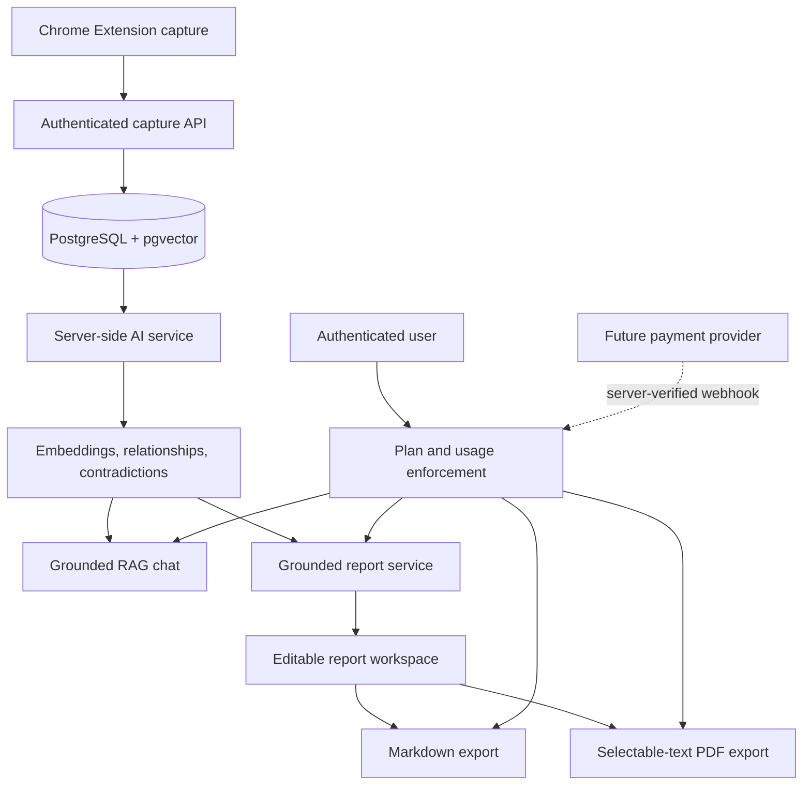

# Phase 7 — Final Product Polish, Reports, Export, Monetization & Production Readiness

## Status

**PHASE 7 COMPLETE — RESEARCHFLOW FINAL BUILD COMPLETE**

Phase 7 adds the final product foundation without rewriting Phases 1–6.

## Final architecture



## Report generation

Reports are generated from a user-owned project only. The report context includes bounded records from:

- Project metadata
- Captured sources and original URLs
- Completed AI summaries
- Key findings
- Research items
- Stored relationships
- Stored potential contradictions

The report prompt explicitly treats captured text as untrusted data. Reports must preserve uncertainty and use only supplied source titles and URLs.

Expected sections:

- Executive Summary
- Research Overview
- Key Findings
- Major Themes
- Supporting Evidence
- Contradictions
- Related Research
- Research Gaps
- Sources
- References
- Conclusion

No report is generated from an empty project, and the backend does not fabricate evidence.

## Report model

Added `ResearchReport` with:

- User and project ownership
- Title
- Status: `PENDING`, `PROCESSING`, `COMPLETED`, `FAILED`
- Markdown content
- Format
- Provider/model metadata
- Error message
- Generated timestamp

The additive migration is:

```text
packages/database/prisma/migrations/20261005250000_phase7_reports_plans/migration.sql
```

## Report APIs

```text
GET  /api/reports
POST /api/reports
GET  /api/reports/:reportId
PATCH /api/reports/:reportId
DELETE /api/reports/:reportId

GET /api/reports/:reportId/export/markdown
GET /api/reports/:reportId/export/pdf
```

All report APIs verify authentication and ownership. Destructive deletion uses the authenticated owner filter.

## Report editor

The `/reports` workspace supports:

- Project selection
- Grounded report generation
- Saved report history
- Report title editing
- Markdown content editing
- Explicit save action
- Markdown export
- PDF export
- Generation, empty, error, and loading states

AI-generated content is clearly labeled as an editable draft. User edits are not silently overwritten.

## Markdown export

Markdown export contains:

- Report title and generated sections
- Findings and citations present in the report
- A References section
- Actual captured source titles and URLs

Export is returned as a downloadable `text/markdown` response.

## PDF export

PDF export uses server-side `pdfkit`, not a screenshot of the web page. It produces selectable text with:

- ResearchFlow branding
- Report title
- Project title
- Generated date
- Report sections
- Findings and references
- Original source URLs

PDF generation runs on the server and is restricted to the authenticated report owner.

## Free and Pro architecture

Current plans:

| Plan | Price | Intended use |
| --- | --- | --- |
| Free | $0 | Student and personal research workflows |
| Pro | $10/month or $50/year | Higher limits and advanced exports |

The existing account plan fields remain compatible. Phase 7 adds a `Subscription` record for future payment-provider state:

- Plan
- Billing interval
- Status
- Provider customer ID
- Provider subscription ID
- Current billing period

No payment gateway or fake checkout was added.

## Usage enforcement

A centralized server-side module defines limits and checks usage before expensive operations.

Current defaults:

| Feature | Free | Pro |
| --- | ---: | ---: |
| Projects | 2 | Unlimited |
| Sources | 30/month | 1000/month fair-use baseline |
| AI analyses | 20/month | 500/month |
| AI chat messages | 30/month | 500/month |
| Reports | 3/month | 100/month |
| Exports | 6/month | 200/month |

Report and export limits are enforced server-side. Usage records use the current UTC calendar month and store:

- User
- Feature
- Count
- Period start
- Period end

Configuration variables:

```env
FREE_REPORT_LIMIT="3"
FREE_EXPORT_LIMIT="6"
PRO_REPORT_LIMIT="100"
PRO_EXPORT_LIMIT="200"
```

The payment interface is prepared for a future server-verified flow:

```text
Checkout → Payment provider → Signed webhook → Server verification → Subscription update
```

## Settings and pricing

Added:

- `/settings` — profile, plan usage, privacy, and security information
- `/pricing` — transparent Free/Pro comparison with no fake checkout

The settings API provides server-calculated plan and usage information.

## Product polish

The dashboard now links to:

- AI Research Chat
- Reports
- Settings

Existing Research Intelligence and RAG Chat experiences are preserved. Reports remain separate from chat so the user can review and edit generated content before export.

## Security hardening

- Report routes enforce user ownership.
- Project ownership is validated before report generation.
- PDF and Markdown exports cannot access another user's report.
- AI and embedding keys remain server-side.
- Report context is bounded.
- Captured webpage text is treated as untrusted data.
- AI output is not rendered as unsanitized HTML.
- Export filenames are sanitized.
- No payment success is trusted from the frontend.
- Plan limits are enforced in backend code.
- Errors return user-safe messages without stack traces.

## Environment and deployment

Required production variables are documented in `.env.example`:

- Database URL
- Application URL
- Auth secret
- AI provider settings
- Embedding provider settings
- RAG settings
- Report context settings
- Plan limits

Production sequence:

```bash
pnpm install --frozen-lockfile
pnpm db:generate
pnpm db:deploy
pnpm lint
pnpm typecheck
pnpm test
pnpm --filter @researchflow/web build
pnpm --filter @researchflow/extension build
pnpm --filter @researchflow/web start
```

PostgreSQL must use the pgvector-enabled Compose image or an equivalent managed PostgreSQL setup with the vector extension enabled.

## B.Tech project support

The project now documents:

- Problem statement
- Objectives
- System architecture
- Database architecture
- AI processing
- Embedding and vector search
- Research intelligence
- RAG chat
- Reports and exports
- Security and privacy
- Plans and usage architecture
- Testing strategy
- Deployment architecture
- Limitations and future scope

No fabricated performance metrics are claimed.

## Known limitations

- The sandbox has no Docker/PostgreSQL server, so migrations and live report generation cannot be exercised end-to-end here.
- The configured sandbox embedding endpoint did not expose the selected embedding model during earlier verification.
- Report generation is synchronous rather than a durable background job.
- Streaming chat remains deferred.
- Source and AI-analysis monthly limits are centralized for future enforcement but only report/export enforcement was added in this final increment.
- Payment integration is intentionally not present.
- The PDF renderer supports readable Markdown headings and text but is not a full Markdown layout engine.
- The current dashboard analytics remain intentionally conservative when no database is available; no fake statistics are displayed.

## Future improvements

- Server-side job queue for long reports
- Streaming report progress
- Full Markdown/PDF styling and footnotes
- Verified payment provider integration
- Broader usage enforcement for source capture and analysis
- Advanced analytics and graph visualization
- Automated deployment pipeline
