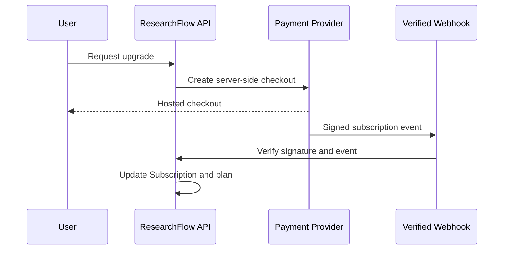

# ResearchFlow Pricing Architecture

## Plans

| Plan | Price | Purpose |
| --- | --- | --- |
| Free | $0 | Useful student and personal research workspace |
| Pro | $10/month or $50/year | Higher limits and advanced report/export workflows |

## Current limits

| Feature | Free | Pro |
| --- | ---: | ---: |
| Projects | 2 | Unlimited |
| Sources | 30/month baseline | 1000/month baseline |
| AI analyses | 20/month | 500/month |
| AI chat messages | 30/month | 500/month |
| Reports | 3/month | 100/month |
| Exports | 6/month | 200/month |

Report and export values can be adjusted with environment variables. The backend remains the source of truth.

## Payment status

Payment processing is not integrated. The UI describes Pro as coming soon rather than presenting fake checkout success.

The database stores future subscription state. A future implementation should follow:

Never update plan state based only on frontend callbacks.
